## keyboard projects:

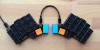 [3W6](https://github.com/weteor/3W6)

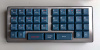 [Brk Out](https://github.com/weteor/BrkOut)

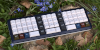 [Chonky Kong](https://github.com/weteor/ChonkyKong)

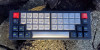 [DigDug](https://github.com/weteor/DigDug)

 [Fitis](https://github.com/weteor/Fitis)

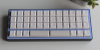 [Frogger](https://github.com/weteor/Froggr) 

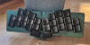 [Grumpy](https://github.com/weteor/Grumpy)

 [Klacker BS](https://github.com/weteor/Klacker_BS)

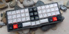 [Kong](https://github.com/weteor/Kong)

 [Lütt un Lütt](https://github.com/weteor/LuttUnLutt)

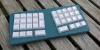 [Oschi](https://github.com/weteor/Oschi)

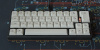 [Qazikat](https://github.com/weteor/Qazikat)

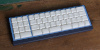 [Qazipad](https://github.com/weteor/Qazipad)

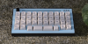 [SPC EVDR](https://github.com/weteor/SPC_EVDR)

 [Tipper TF](https://github.com/weteor/Tipper-TF)

<!--
**weteor/weteor** is a ✨ _special_ ✨ repository because its `README.md` (this file) appears on your GitHub profile.

Here are some ideas to get you started:

- 🔭 I’m currently working on ...
- 🌱 I’m currently learning ...
- 👯 I’m looking to collaborate on ...
- 🤔 I’m looking for help with ...
- 💬 Ask me about ...
- 📫 How to reach me: ...
- 😄 Pronouns: ...
- ⚡ Fun fact: ...
-->
